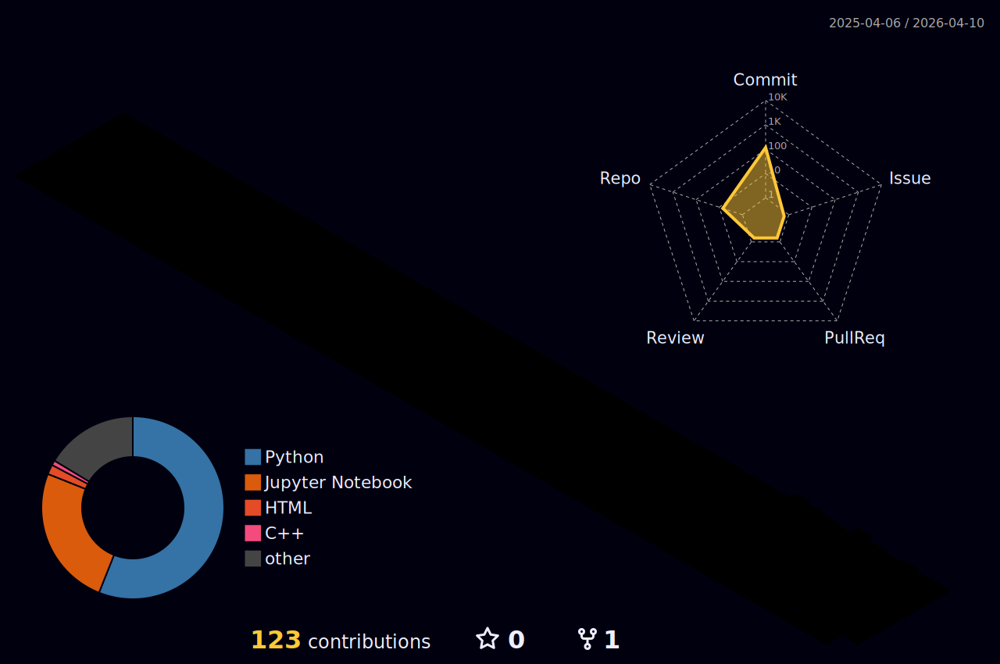

  

  

## <picture>   </picture> More About Me

<picture> </picture>

🏫 **I am a Senior Undergraduate Student** at the [Faculty of Artificial Intelligence](https://ai.deltauniv.edu.eg/en/home/index) at [Delta University for Science and Technology](https://new.deltauniv.edu.eg/en/home/index).  

📚 Specializing in **Artificial Intelligence**, **Machine Learning**, and **Building Smart Mobile Applications** with Flutter.  

🤖 I have a strong passion for bridging the gap between complex AI models and user-friendly interfaces to create end-to-end solutions.  

💡 Passionate about building AI-powered applications aimed at solving real-world problems like healthcare and accessibility.

🚀 Currently focusing on enhancing my problem-solving skills and deploying scalable AI applications.

 

## 🧠 My Coding Profiles

  

 

## 💬 Connect With Me

  
  

 

## <picture></picture> My Tech Stack & Skills

> ### 💻 Programming Languages

 

> ### 📊 Data Science & AI

 
 
 
 

> ### 📱 Mobile & Frameworks

 

  

> ### 🛠️ Tools & Databases

 
 
 

  
<h2 align="left">📝 My Projects and Resume</h2>

  👨‍💻 Check out my latest work at <a href="https://github.com/mernaabass?tab=repositories">My Repositories</a>.

  📫 How to reach me: <strong>mernaabass@outlook.com</strong>.

  📄 View my detailed experience: <a href="https://drive.google.com/file/d/1oMrAHFVUyuFPZiG0b8sB6EzqNRtn8nO_/view?usp=drive_link" target="_blank"><strong>Download My Resume</strong></a>

  

## <picture></picture> My Profile Statistics
 

  <picture>
    <source media="(prefers-color-scheme: dark)" srcset="./profile-3d-contrib/profile-night-rainbow.svg" />
    <source media="(prefers-color-scheme: light)" srcset="./profile-3d-contrib/profile-season-animate.svg" />
    
  </picture>

  

  

